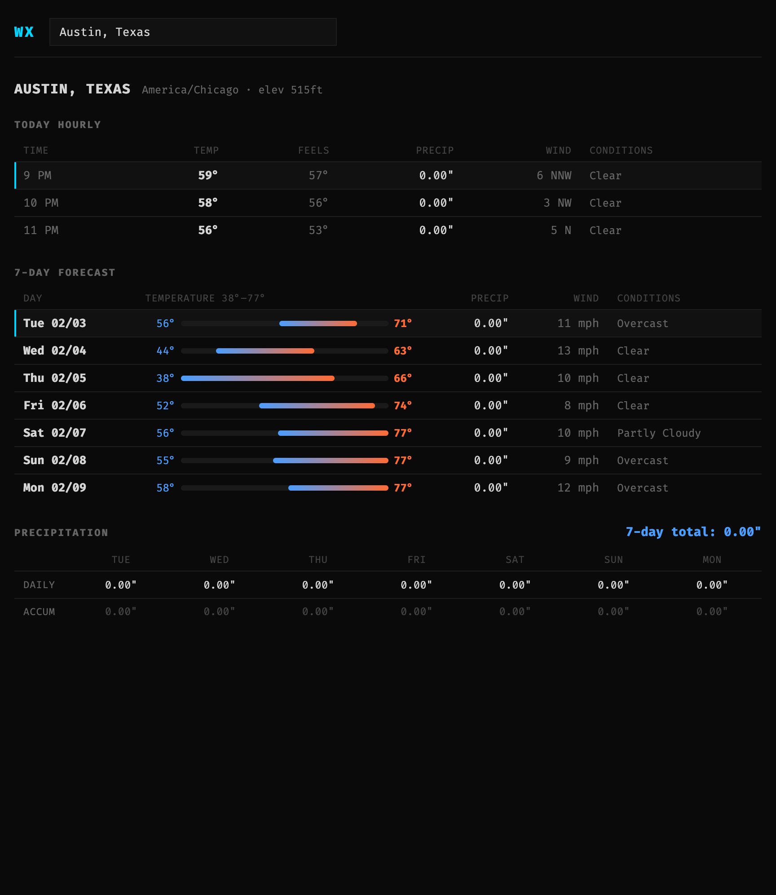

# WX

Minimal, information-dense weather dashboard. Go backend (stdlib only), htmx frontend, Open-Meteo API.



## Features

- **Hourly forecast** for the current day: temperature, feels like, precipitation, wind speed/direction, conditions
- **7-day daily forecast** with temperature range bars scaled to the global min/max across the forecast window
- **Precipitation accumulation** table showing daily amounts and running cumulative totals
- **City search** with debounced typeahead via Open-Meteo geocoding
- **Browser geolocation** auto-detects on load, falls back to search prompt if denied
- **Current hour/day highlighting** with accent border on active rows

## Stack

- **Backend:** Go standard library (`net/http`, `html/template`, `encoding/json`) — zero external dependencies
- **Frontend:** [htmx](https://htmx.org/) for HTML fragment swapping, pure CSS dark theme
- **API:** [Open-Meteo](https://open-meteo.com/) — free, no API key required

## Live

**https://wx-weather.fly.dev**

## Running locally

```
go run main.go
```

Open http://localhost:8080

## Deploying

Hosted on [Fly.io](https://fly.io/) using the included `Dockerfile` and `fly.toml`.

```
fly auth login
fly deploy
```

The app reads `PORT` from the environment (defaults to 8080). Fly machines auto-stop when idle and wake on incoming requests.

## How it works

The server exposes three routes:

| Route | Purpose |
|---|---|
| `GET /` | Serves the page shell with htmx and geolocation JS |
| `GET /forecast?lat=&lon=&name=` | Fetches weather from Open-Meteo, returns an HTML fragment |
| `GET /search?q=` | Geocodes a location name, returns clickable results as an HTML fragment |

On page load, the browser geolocation API requests coordinates. On success, htmx fires a request to `/forecast` and swaps the result into the page. If geolocation is denied, the user types a city into the search box, which triggers debounced requests to `/search`. Clicking a result loads that city's forecast.

All data transforms (zipping parallel arrays, computing temperature bar percentages, accumulating precipitation) happen server-side in `main.go`. Templates receive ready-to-render view-model structs.

## Project structure

```
main.go              Server, routes, API calls, data transforms
go.mod               Module file (no external deps)
Dockerfile           Multi-stage build (compile + alpine runtime)
fly.toml             Fly.io deployment config
templates/
  base.html          Page shell: htmx script, search input, geolocation JS
  forecast.html      Hourly table + daily forecast with range bars + precipitation
  search.html        Geocoding results dropdown
  error.html         Error message fragment
static/
  style.css          Dark theme, monospace typography, range bar CSS
```
